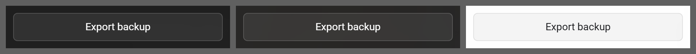

# Button

**Where it is used:** Export backup, Import backup, Import Chrome Bookmarks, Change, Remove

**Panel:** Settings  
**Sampled from:** `#settings-export-backup`



_Left to right: `has-bg bg-dark` (#2a2a2a), `has-bg bg-image` (the gallery's Tropical beach), `has-bg bg-light` (#f5f5f5). The mid-grey is the sheet, not the product._

## The markup, as it renders

Taken from the live DOM rather than `newtab.html`, because about a third of Pro Settings is injected at runtime and the static file does not contain it.

```html
<div class="settings-row">
  <button data-i18n="settings_export_backup" id="settings-export-backup" type="button" class="settings-btn settings-btn-full">Export backup</button>
</div>
```

## The rules that style it

Every rule in `newtab.css` whose selector names one of: `.settings-btn`. 7 rules.

```css
/* --- Settings Buttons --- */

.settings-btn {
  padding: var(--space-1-5) 14px;
  border: 1px solid var(--border);
  border-radius:var(--radius-md);
  background: var(--bg);
  color: var(--text-primary);
  font-size: var(--fs-12);
  font-weight: 500;
  font-family: inherit;
  cursor: pointer;
  transition: background-color 0.15s, border-color 0.15s;
}

.settings-btn:hover {
  background: var(--bg-hover);
  border-color: var(--text-hint);
}

/* [ink] RECLASSIFIED, NOT FIXED, AND THE MEASUREMENT WAS OF THIS RULE.
   The light-ground sweep reported "Cancel subscription" and "Reactivate" under
   the floor on every ground (2.68 - 4.45) and the round that filed it read that
   as a destructive action being illegible. It is not: the sweep's fixture has
   dev-Pro on and no real subscription, so both buttons were DISABLED, and what
   was measured is this 0.5 - the declared ink is #202124, which clears
   comfortably at full strength.
   An inactive control is explicitly exempt from the contrast minimum (WCAG 2.1
   SC 1.4.3), and for a reason that applies exactly here: dimming is how a
   disabled control says it is disabled, and darkening it back to the floor
   would make "you cannot press this" invisible. The ENABLED state is what has
   to clear 4.5, and it does. */
.pro-sub-actions .settings-btn:disabled {
  opacity: 0.5;
  cursor: not-allowed;
}

html.has-bg .settings-btn {
  background: rgba(255, 255, 255, 0.08);
  border-color: rgba(255, 255, 255, 0.15);
  color: #fff;
}

html.has-bg .settings-btn:hover {
  background: rgba(255, 255, 255, 0.15);
}

html.bg-light .settings-btn {
  background: rgba(0, 0, 0, 0.04);
  border-color: rgba(0, 0, 0, 0.08);
  color: var(--text-primary);
}

html.bg-light .settings-btn:hover {
  background: rgba(0, 0, 0, 0.06);
}

```
