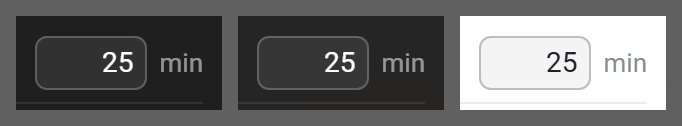

# Number input

**Where it is used:** Work / Short break / Long break, Cycles before long break, Daily focus target, Count me idle after

**Panel:** Pro Settings  
**Sampled from:** `#pomo-work-min`



_Left to right: `has-bg bg-dark` (#2a2a2a), `has-bg bg-image` (the gallery's Tropical beach), `has-bg bg-light` (#f5f5f5). The mid-grey is the sheet, not the product._

## The markup, as it renders

Taken from the live DOM rather than `newtab.html`, because about a third of Pro Settings is injected at runtime and the static file does not contain it.

```html
<span class="pomo-setting-field">
  <input type="number" id="pomo-work-min" class="pomo-setting-input" min="5" max="60" step="1" inputmode="numeric">
  <span data-i18n="common_unit_minutes" class="pomo-setting-unit">min</span>
</span>
```

## The rules that style it

Every rule in `newtab.css` whose selector names one of: `.pomo-setting-field`, `.pomo-setting-input`, `.pomo-setting-unit`. 10 rules.

```css
.pomo-setting-field {
  display: inline-flex;
  align-items: center;
  gap: var(--space-1-5);
  flex-shrink: 0;
}

.pomo-setting-unit {
  font-size: var(--fs-12); opacity: 0.75;
}

.pomo-setting-input {
  width: 56px;
  padding: var(--space-1) var(--space-1-5);
  border-radius:var(--radius-md);
  border: 1px solid var(--border);
  background: rgba(255, 255, 255, 0.06);
  color: inherit;
  font: inherit;
  font-size: var(--fs-13);
  text-align: end;
  font-variant-numeric: tabular-nums;
  appearance: textfield;
}

.pomo-setting-input:focus {
  outline: none; border-color: var(--accent);
}

/* [fix, 2026-09-03] AN EMPTY OPTIONAL FIELD MUST READ AS AN INVITATION, NOT AS
   A LOCK. The daily focus target is the only OPTIONAL numeric input on these
   surfaces - the four Pomodoro fields are always populated by their defaulting
   reader and are never empty - and empty, it read as gated on a panel where
   several controls genuinely are gated by tier.
   THIS IS THE MIRROR OF THE [1.7.4] DISABLED-CTA FIX, and the same one rule:
   THE AFFORDANCE MUST MATCH THE STATE. There, a dead button looked live; here,
   a live field looked dead.
   The placeholder now carries the hint ROLE explicitly rather than inheriting a
   browser default that lands near the disabled ink, and the helper text beneath
   already explains what empty means, so the placeholder can be an example
   instead of the word "none". Scoped to the shared class so all five fields
   stay consistent, which is why this is one rule and not one patch. */
.pomo-setting-input::placeholder {
  color: var(--ink-hint);
  opacity: 1;                 /* Firefox dims placeholders by default */
}

/* [1.0.18] Hide the native number spinners: on the dark panel Chromium draws
   them as light-grey widgets that match nothing around them. SCOPED to this
   class deliberately — three other number inputs exist (.tt-recur-dom-input,
   .tt-tpl-offset-input, .sat-pomo-dur-input) and keep their spinners.
   Keyboard ArrowUp/Down still steps the value, so the affordance survives; the
   clamp on save is storage-side and untouched. */
.pomo-setting-input::-webkit-outer-spin-button,
.pomo-setting-input::-webkit-inner-spin-button {
  -webkit-appearance: none;
  margin: 0;
}

html.has-bg .pomo-setting-input {
  background: rgba(255, 255, 255, 0.08);
  /* [fix] 0.14 -> 0.22. The reported complaint was that an empty optional field
  "looks like a gated, unclickable field", and a hairline at 0.14 measured
  1.54:1 against the floater - present, but not enough to say "input". */
  border-color: rgba(255, 255, 255, 0.22);
  color: #fff;
}

/* [fix] THE PLACEHOLDER IS SET PER BRANCH, BESIDE THE INK IT BELONGS WITH.
   The shared rule uses var(--ink-hint), which is white at :root - so on a LIGHT
   wallpaper the placeholder was white on a white field, 1.04:1. The four-frame
   pass caught it; the naive reading would not have, and this is the fifth time
   this project has met the shape. */
html.has-bg .pomo-setting-input::placeholder {
  color: rgba(255, 255, 255, 0.40);
}

html.bg-light .pomo-setting-input {
  background: rgba(0, 0, 0, 0.04);
  border-color: rgba(0, 0, 0, 0.22);
  color: var(--text-primary);
}

html.bg-light .pomo-setting-input::placeholder {
  color: rgba(0, 0, 0, 0.45);
}

```
