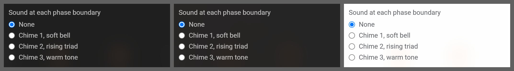

# Radio group

**Where it is used:** Sound at each phase boundary (the only one in the product)

**Panel:** Pro Settings  
**Sampled from:** `.pomo-sound`



_Left to right: `has-bg bg-dark` (#2a2a2a), `has-bg bg-image` (the gallery's Tropical beach), `has-bg bg-light` (#f5f5f5). The mid-grey is the sheet, not the product._

## The markup, as it renders

Taken from the live DOM rather than `newtab.html`, because about a third of Pro Settings is injected at runtime and the static file does not contain it.

```html
<div class="pomo-sound">
  <span data-i18n="prosettings_sound_at_each_phase_boundary" class="pomo-sound-title">Sound at each phase boundary</span>
  <div class="pomo-sound-options" id="pomo-sound-options">
    <div class="pomo-sound-row">
      <label class="pomo-sound-label">
        <input type="radio" name="pomo-sound" value="none">
        <span data-i18n="prosettings_none">None</span>
      </label>
    </div>
    <div class="pomo-sound-row">
      <label class="pomo-sound-label">
        <input type="radio" name="pomo-sound" value="chime1">
        <span data-i18n="prosettings_chime_1_soft_bell">Chime 1, soft bell</span>
      </label>
    </div>
    <div class="pomo-sound-row">
      <label class="pomo-sound-label">
        <input type="radio" name="pomo-sound" value="chime2">
        <span data-i18n="prosettings_chime_2_rising_triad">Chime 2, rising triad</span>
      </label>
    </div>
    <div class="pomo-sound-row">
      <label class="pomo-sound-label">
        <input type="radio" name="pomo-sound" value="chime3">
        <span data-i18n="prosettings_chime_3_warm_tone">Chime 3, warm tone</span>
      </label>
    </div>
  </div>
</div>
```

## The rules that style it

Every rule in `newtab.css` whose selector names one of: `.pomo-sound`, `.pomo-sound-row`, `.pomo-sound-label`, `.pomo-sound-title`, `.pomo-sound-options`. 10 rules.

```css
/* [1.0.18 B-1] had a pointer-cursor opt-out here for the notifications row.
   [1.2.1] deleted it: the base .pro-toggle-row is cursor:pointer now, so the
   opt-out is inherited, not declared. Leaving a rule that opts out of a default
   that no longer exists is how the next reader concludes the opt-out is still
   load-bearing and copies it into a fourth row. */
/* [1.0.18] Group rhythm. Focus sessions stacks four unrelated control groups —
   [durations] [reset] [notifications] [sound] — and the notifications row was
   the one seam with NO gap, so it read as part of the reset group. 12px is the
   panel's established inter-group step (.settings-section-title margin-bottom,
   .pomo-reset-row, .pomo-sound all use it), not a new number. Scoped by :has to
   this instance so the Analytics .pro-toggle-row is unaffected. With the reset
   row's own 12px above, it now has equal breathing room on both sides. */
.pro-toggle-row:has(#pomo-notifications-toggle) {
  margin-top: var(--space-3);
}

= #202124, which on
   the dark frosted panel (--pro-frost-floater-bg) is ~1.1:1 — invisible. Same
   mechanism as a68dd89 (Insights on-card ink). Do not rely on inheritance here:
   the panel's own surface flips with the wallpaper, the ink must flip with it. */
.pomo-sound {
  margin-top: var(--space-3);
}

.pomo-sound-title {
  display: block;
  font-size: var(--fs-13);
  color: var(--text-secondary);
  margin-bottom: var(--space-1-5);
}

.pomo-sound-options {
  display: flex; flex-direction: column; gap: 2px;
}

.pomo-sound-row {
  display: flex;
  align-items: center;
  gap: var(--space-2);
  font-size: var(--fs-13);
  padding: 2px 0;
  color: var(--text-secondary);
}

.pomo-sound-label {
  display: inline-flex; align-items: center; gap: var(--space-2); flex: 1; cursor: pointer;
}

html.has-bg .pomo-sound-title,
html.has-bg .pomo-sound-row {
  color: var(--ink-secondary);
}

html.bg-light .pomo-sound-title,
html.bg-light .pomo-sound-row {
  color: var(--text-secondary);
}

.pomo-sound-label input {
  cursor: pointer;
}

/* Group rhythm: 12px is the panel's established inter-group step
   (.settings-section-title margin-bottom, .pomo-reset-row, .pomo-sound and the
   notifications row all use it) — measured, not invented.
   Scoped by the section class rather than :has() because this section has one,
   which the notifications row did not; same effect, one less selector feature.
   [1.2.1] The pointer-cursor override that used to live here is gone — the base
   .pro-toggle-row is cursor:pointer now, so this row inherits it. Only the
   group-rhythm margin was ever specific to this section. */
.focus-block-section .pro-toggle-row {
  margin-top: var(--space-3);
}

```
