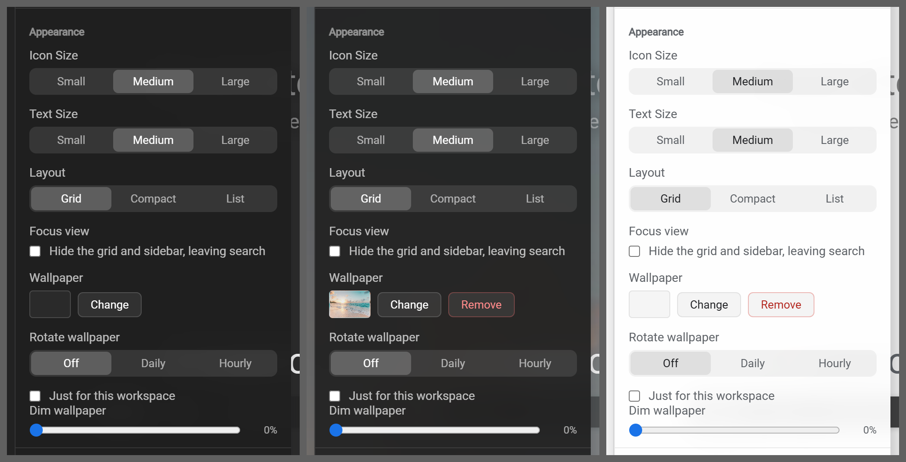

# Section and row wrappers

**Where it is used:** every section on both panels

**Panel:** Settings  
**Sampled from:** `#settings-panel .settings-section`



_Left to right: `has-bg bg-dark` (#2a2a2a), `has-bg bg-image` (the gallery's Tropical beach), `has-bg bg-light` (#f5f5f5). The mid-grey is the sheet, not the product._

## The markup, as it renders

Taken from the live DOM rather than `newtab.html`, because about a third of Pro Settings is injected at runtime and the static file does not contain it.

```html
<div class="settings-section">
  <h3 data-i18n="settings_appearance" class="settings-section-title">Appearance</h3>
  <div class="settings-row">
    <label data-i18n="settings_icon_size" class="settings-label">Icon Size</label>
    <div class="settings-segmented" id="settings-icon-size">
      <button data-i18n="settings_textsize_small" class="seg-btn" data-value="small" type="button">Small</button>
      <button data-i18n="settings_textsize_medium" class="seg-btn active" data-value="medium" type="button">Medium</button>
      <button data-i18n="settings_textsize_large" class="seg-btn" data-value="large" type="button">Large</button>
    </div>
  </div>
  <div class="settings-row">
    <label data-i18n="settings_text_size" class="settings-label">Text Size</label>
    <div class="settings-segmented" id="settings-text-size">
      <button data-i18n="settings_iconsize_small" class="seg-btn" data-value="small" type="button">Small</button>
      <button data-i18n="settings_iconsize_medium" class="seg-btn active" data-value="medium" type="button">Medium</button>
      <button data-i18n="settings_iconsize_large" class="seg-btn" data-value="large" type="button">Large</button>
    </div>
  </div>
  <!-- [1.10.3] LAYOUT. A third segmented control in the same shape as
  Icon Size and Text Size above, because it is the same kind of
  setting: one value, a root class, the default unclassed. -->
  <div class="settings-row">
    <label data-i18n="settings_layout" class="settings-label">Layout</label>
    <div class="settings-segmented" id="settings-layout">
      <button data-i18n="settings_layout_grid" class="seg-btn active" data-value="grid" type="button">Grid</button>
      <button data-i18n="settings_layout_compact" class="seg-btn" data-value="compact" type="button">Compact</button>
      <button data-i18n="settings_layout_list" class="seg-btn" data-value="list" type="button">List</button>
    </div>
  </div>
  <div class="settings-row settings-row-stack">
    <label data-i18n="settings_focus_view" class="settings-label">Focus view</label>
    <label class="pro-toggle-row">
      <input type="checkbox" id="settings-focus-view">
      <span data-i18n="settings_hide_the_grid_and_sidebar">Hide the grid and sidebar, leaving search</span>
    </label>
  </div>
  <div class="settings-row settings-wallpaper-row">
    <label data-i18n="settings_wallpaper" class="settings-label">Wallpaper</label>
    <div class="settings-wallpaper-controls">
      <div id="settings-wallpaper-thumb" class="settings-wallpaper-thumb" style="background-image: none; background-color: rgb(42, 42, 42);">
      </div>
      <button data-i18n="settings_change" id="settings-change-wallpaper" type="button" class="settings-btn">Change</button>
      <button data-i18n="common_remove" id="settings-remove-wallpaper" type="button" class="settings-btn settings-btn-danger" style="display: none;">Remove</button>
    </div>
  </div>
  <div class="settings-row">
    <label data-i18n="settings_rotate_wallpaper" class="settings-label">Rotate wallpaper</label>
    <div class="settings-segmented" id="settings-wallpaper-rotate">
      <button data-i18n="settings_rotate_off" class="seg-btn active" data-value="off" type="button">Off</button>
      <button data-i18n="settings_rotate_day" class="seg-btn" data-value="day" type="button">Daily</button>
      <button data-i18n="settings_rotate_hour" class="seg-btn" data-value="hour" type="button">Hourly</button>
    </div>
  </div>
  <div id="settings-wallpaper-per-ws-row" class="settings-perws-row">
    <label class="pro-toggle-row">
      <input type="checkbox" id="settings-wallpaper-per-ws">
      <span data-i18n="settings_wallpaper_this_workspace">Just for this workspace</span>
    </label>
  </div>
  <p id="settings-wallpaper-note" class="settings-wallpaper-note hidden">
  </p>
  <div class="settings-row settings-dim-row">
    <label data-i18n="settings_dim_wallpaper" class="settings-label" for="settings-wall-dim">Dim wallpaper</label>
    <div class="settings-dim-controls">
      <input id="settings-wall-dim" class="settings-dim-range" type="range" min="0" max="0.6" step="0.05" value="0">
      <span id="settings-wall-dim-value" class="settings-dim-value">0%</span>
    </div>
  </div>
</div>
```

## The rules that style it

Every rule in `newtab.css` whose selector names one of: `.settings-section`, `.settings-row`, `.settings-label`, `.settings-body`. 12 rules.

```css
.settings-body {
  flex: 1;
  overflow-y: auto;
  padding: var(--space-2) 0;
  scrollbar-width: thin;
  scrollbar-color: rgba(0, 0, 0, 0.1) transparent;
}

.settings-section {
  padding: var(--space-3) var(--space-4);
}

.settings-section + .settings-section {
  border-top: 1px solid var(--border);
}

.settings-row {
  margin-bottom: 14px;
}

.settings-row:last-child {
  margin-bottom: 0;
}

.settings-label {
  display: block;
  font-size: var(--fs-13);
  color: var(--text-secondary);
  margin-bottom: var(--space-1-5);
}

html.has-bg .settings-section + .settings-section {
  border-top-color: var(--surface-fill);
}

html.has-bg .settings-label {
  color: var(--ink-secondary);
}

html.bg-light .settings-section + .settings-section {
  border-top-color: rgba(0, 0, 0, 0.08);
}

html.bg-light .settings-label {
  color: var(--text-secondary);
}

/* [1.11.1b] FINDING 1. The intro ran wall to wall while the header above it was
   inset, because .settings-body is `padding: var(--space-2) 0` - zero
   horizontal by design - and the inset every sibling panel shows comes from
   .settings-section, which each of them wraps its content in and [1.11.1] did
   not. The markup now uses that wrapper, so this panel inherits the shared
   inset instead of carrying a private copy of the number.
   The TREE then pulls its own share back, because a 16px section inset plus
   13px per depth level plus the row's own 8px would put a level-6 title 102px
   into a 320px panel. Rows bleed to the section's edges and pay for their
   indentation out of that, so depth has somewhere to go. */
.bm-section {
  padding-bottom: var(--space-2);
}

.settings-row-stack .settings-label {
  display: block; margin-bottom: 6px;
}

```
