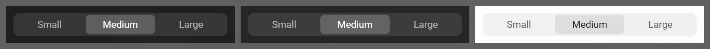

# Segmented control

**Where it is used:** Icon size, Text size, Layout, Rotate wallpaper

**Panel:** Settings  
**Sampled from:** `#settings-icon-size`



_Left to right: `has-bg bg-dark` (#2a2a2a), `has-bg bg-image` (the gallery's Tropical beach), `has-bg bg-light` (#f5f5f5). The mid-grey is the sheet, not the product._

## The markup, as it renders

Taken from the live DOM rather than `newtab.html`, because about a third of Pro Settings is injected at runtime and the static file does not contain it.

```html
<div class="settings-segmented" id="settings-icon-size">
  <button data-i18n="settings_textsize_small" class="seg-btn" data-value="small" type="button">Small</button>
  <button data-i18n="settings_textsize_medium" class="seg-btn active" data-value="medium" type="button">Medium</button>
  <button data-i18n="settings_textsize_large" class="seg-btn" data-value="large" type="button">Large</button>
</div>
```

## The rules that style it

Every rule in `newtab.css` whose selector names one of: `.settings-segmented`, `.seg-btn`. 17 rules.

```css
` lands, and defers to a fully native list
   elsewhere, where it does not - so a stylesheet fix would read correct on the
   machine it was written on and stay broken on others.

   Which is why the control was replaced rather than recoloured: the
   .settings-segmented this panel already uses three times needs no popup at
   all, so there is no second half of the pair to lose control of. It removes
   the element that carries the bug, and it ends the fourth choice-of-three
   being the odd one out. */
.settings-perws-row.is-locked {
  opacity: 0.55;
}

/* --- Segmented Control --- */

.settings-segmented {
  display: flex;
  background: var(--icon-bg);
  border-radius:var(--radius-lg);
  padding: 2px;
  gap: 2px;
}

.seg-btn {
  flex: 1;
  padding: var(--space-1-5) 0;
  border: none;
  background: transparent;
  border-radius:var(--radius-md);
  font-size: var(--fs-12);
  font-weight: 500;
  font-family: inherit;
  color: var(--text-secondary);
  cursor: pointer;
  transition: background-color 0.15s, color 0.15s, box-shadow 0.15s;
}

.seg-btn:hover {
  color: var(--text-primary);
}

.seg-btn.active {
  background: var(--bg-card);
  color: var(--text-primary);
  box-shadow: 0 1px 3px rgba(0, 0, 0, 0.12);
}

/* --- Insights date-range selector ([1.2.2]) ---
   LAYOUT ONLY. The control reuses .settings-segmented/.seg-btn, whose base,
   html.has-bg and html.bg-light rules already declare every colour and already
   drop the shadow on wallpapers. Declaring a colour here would fork that ink
   into a second place to keep in sync, which is the bug class the panel-ink
   gate exists for - and this board is JS-rendered, so the gate cannot see it. */
.insights-range {
  display: flex;
  justify-content: flex-end;
  margin-bottom: var(--space-3);
}

.insights-range-seg .seg-btn {
  flex: 0 0 auto;
  padding: var(--space-1-5) 14px;
}

/* --- Insights custom range ([1.2.2 R2]) ---
   The date fields are NATIVE <input type="date">. The only reason this needs
   any theme rule at all is color-scheme: a native control paints its own
   internals (text, the calendar indicator, the dropdown) from the scheme, not
   from `color`, so on a wallpaper the default light control sits black-on-white
   against a dark frosted panel. Setting the scheme flips the whole native
   control at once, which is why there is still no per-element colour here.
   Three tiers, matching .seg-btn's existing structure exactly: default board is
   light, wallpaper is dark, light wallpaper is light again. */
.insights-range-custom {
  display: flex;
  align-items: flex-end;
  justify-content: flex-end;
  flex-wrap: wrap;
  gap: var(--space-2-5) 14px;
  margin: -4px 0 14px;
}

html.has-bg .settings-segmented {
  background: var(--surface-fill);
}

html.has-bg .seg-btn {
  color: var(--ink-meta);
}

html.has-bg .seg-btn:hover {
  color: #fff;
}

html.has-bg .seg-btn.active {
  background: rgba(255, 255, 255, 0.2);
  color: #fff;
  box-shadow: none;
}

html.bg-light .settings-segmented {
  background: rgba(0, 0, 0, 0.05);
}

html.bg-light .seg-btn {
  color: var(--text-secondary);
}

html.bg-light .seg-btn:hover {
  color: var(--text-primary);
}

html.bg-light .seg-btn.active {
  background: rgba(0, 0, 0, 0.08);
  color: var(--text-primary);
  box-shadow: none;
}

/* [1.8.6] THE IDLE RANGE PILL, and the two ways a first attempt at this rule
   got it wrong, because both are the kind that measure fine on one branch.

   html.has-bg .seg-btn paints idle labels in --ink-meta (white at 0.60), which
   over the bar's composited backdrop measured 4.16:1 on the bright ground. The
   fix is one declaration, and it needs BOTH of its exclusions:

     :not(.bg-light) - because .bg-light IS .has-bg, an unqualified has-bg rule
     also fires on the light-wallpaper branch, where the bar is white-tinted.
     Near-white ink there measured 1.10:1. That is the trap CLAUDE.md names, and
     writing it unqualified reproduced it exactly.

     :not(.active) - because html.has-bg .seg-btn.active sets color #fff at the
     same specificity, and this rule comes later in the file, so unqualified it
     silently took the ACTIVE pill's ink DOWN from #fff to 0.78 and dropped it
     from 4.80:1 to 3.64:1. A rule aimed at the idle state damaged the one state
     that was already passing.

   Scoped to the Insights range control, not .seg-btn generally: the same
   declaration serves every segmented control in Settings, and widening it there
   is a separate change that needs its own evidence. */
html.has-bg:not(.bg-light) .insights-range-seg .seg-btn:not(.active) {
  color: rgba(255, 255, 255, 0.78);
}

```
