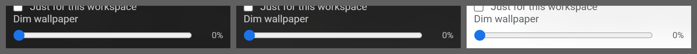

# Slider

**Where it is used:** Dim wallpaper (the only one in the product)

**Panel:** Settings  
**Sampled from:** `#settings-wall-dim`



_Left to right: `has-bg bg-dark` (#2a2a2a), `has-bg bg-image` (the gallery's Tropical beach), `has-bg bg-light` (#f5f5f5). The mid-grey is the sheet, not the product._

## The markup, as it renders

Taken from the live DOM rather than `newtab.html`, because about a third of Pro Settings is injected at runtime and the static file does not contain it.

```html
<div class="settings-row settings-dim-row">
  <label data-i18n="settings_dim_wallpaper" class="settings-label" for="settings-wall-dim">Dim wallpaper</label>
  <div class="settings-dim-controls">
    <input id="settings-wall-dim" class="settings-dim-range" type="range" min="0" max="0.6" step="0.05" value="0">
    <span id="settings-wall-dim-value" class="settings-dim-value">0%</span>
  </div>
</div>
```

## The rules that style it

Every rule in `newtab.css` whose selector names one of: `.settings-dim-row`, `.settings-dim-range`, `.settings-dim-controls`, `.settings-dim-value`. 5 rules.

```css
.settings-dim-controls {
  display: flex;
  align-items: center;
  gap: var(--space-2);
}

.settings-dim-range {
  flex: 1;
  min-width: 0;
  accent-color: var(--accent);
}

.settings-dim-value {
  min-width: 34px;
  text-align: end;
  font-size: var(--fs-11);
  font-variant-numeric: tabular-nums;
  color: var(--text-secondary);
}

html.has-bg .settings-dim-value {
  color: var(--ink-meta);
}

html.has-bg.bg-light .settings-dim-value {
  color: var(--text-secondary);
}

```
