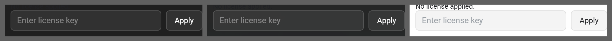

# Text input

**Where it is used:** Licence key, New workspace name, blocked-site entry

**Panel:** Pro Settings  
**Sampled from:** `#pro-license-input`



_Left to right: `has-bg bg-dark` (#2a2a2a), `has-bg bg-image` (the gallery's Tropical beach), `has-bg bg-light` (#f5f5f5). The mid-grey is the sheet, not the product._

## The markup, as it renders

Taken from the live DOM rather than `newtab.html`, because about a third of Pro Settings is injected at runtime and the static file does not contain it.

```html
<div class="settings-row pro-license-input-row">
  <input data-i18n-placeholder="prosettings_enter_license_key" type="text" id="pro-license-input" placeholder="Enter license key" autocomplete="off" spellcheck="false">
  <button data-i18n="common_apply" id="pro-license-apply" type="button" class="settings-btn">Apply</button>
</div>
```

## The rules that style it

Every rule in `newtab.css` whose selector names one of: `.pro-license-input-row`, `#pro-license-input`, `#pro-license-apply`. 7 rules.

```css
.pro-license-input-row {
  display: flex;
  gap: var(--space-2);
  align-items: stretch;
}

#pro-license-input {
  flex: 1;
  min-width: 0;
  padding: var(--space-2) var(--space-2-5);
  border: 1px solid var(--border);
  border-radius:var(--radius-md);
  background: var(--bg);
  color: var(--text-primary);
  font-family: inherit;
  font-size: var(--fs-13);
}

#pro-license-input:focus {
  outline: none;
  border-color: var(--accent);
}

html.has-bg #pro-license-input {
  background: rgba(255, 255, 255, 0.08);
  border-color: rgba(255, 255, 255, 0.15);
  color: #fff;
}

html.has-bg #pro-license-input::placeholder {
  color: var(--ink-hint);
}

html.bg-light #pro-license-input {
  background: rgba(0, 0, 0, 0.04);
  border-color: rgba(0, 0, 0, 0.08);
  color: var(--text-primary);
}

html.bg-light #pro-license-input::placeholder {
  color: var(--text-hint);
}

```
